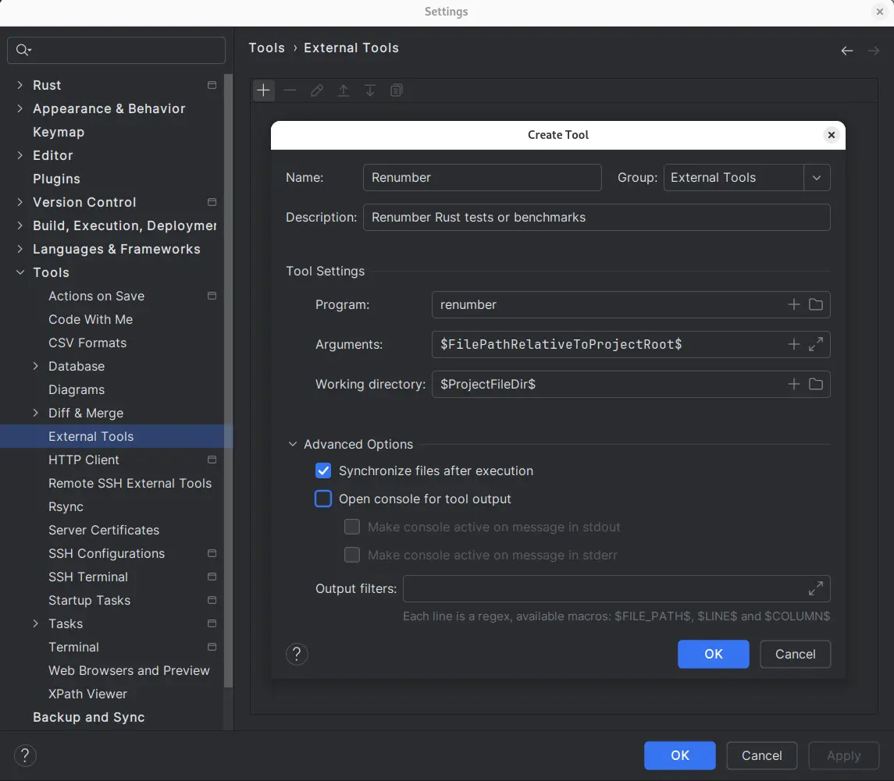
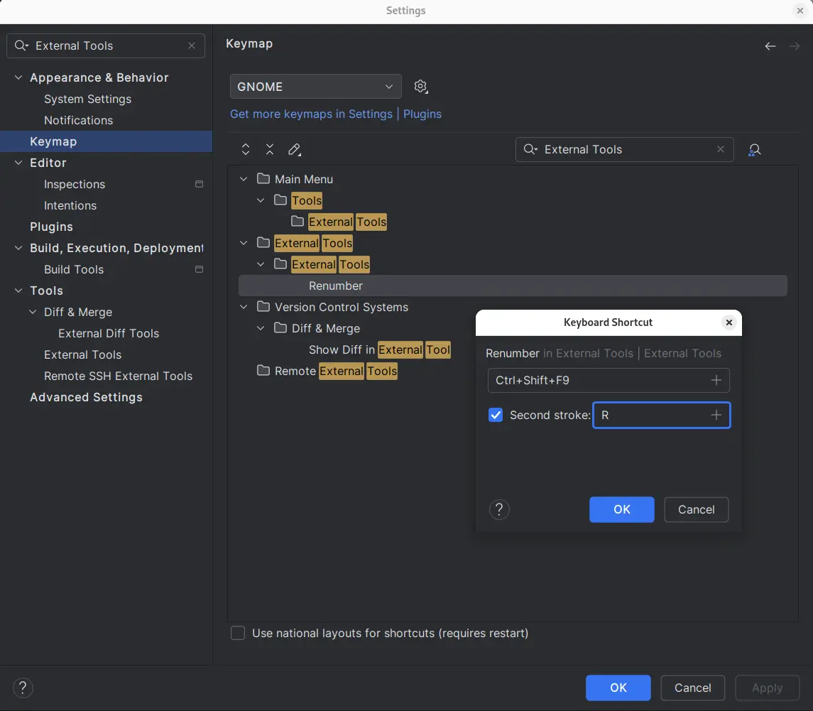
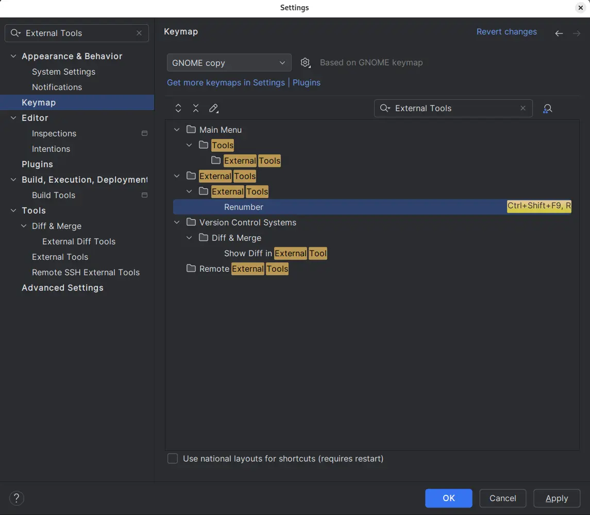

# Renaming Rust tests or benchmarks

To rename Rust tests or benchmarks use [**renumber**][renumber] crate.

## Installation

```shell
cargo install renumber
```

## Usage

```shell
renumber file_name_with_tests_or_benchmarks
```

## Integration with JetBrains tools

Open **Settings** | **Tools** | **External Tools** window.
 
Add a new configuration as shown below:



Add new keyboard shortcut:



Accept changes:



[renumber]: https://crates.io/crates/renumber
